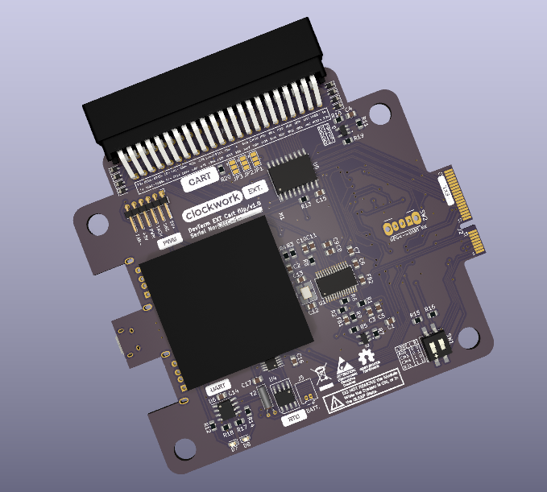

# DevTerm-ExtCart

An extension board for the DevTerm, with Commodore64-style 44pin cartridge.
 

## Design desiderata

Pin assignment:
- Maximum compatibility and function alignment.
- Strong coupling of differential pairs.
- Avoid damage.
All power pins are mirror safe.
Expansion port requirement:
- Pin 21 MUST connect to Pin 23.
- Pin 24 MUST be NC
ROUTE_EN disconnects all routed pins when cartridge is:
- Disconnected
- Inserted the wrong direction
Resource overview:
- 8x internal GPIOs
- 8x external GPIOs
- MIPI-CSI
- 3x USB 2.0
- 1x SPI
- 1x I2C
- 1x UART (Debug)
Resource management pins:
- IO36 for power management
- IO43 for cartridge detection

## PCB Physical specifications

- EXT board:
  - size: 89mm (height) x 101mm (width)
  - thickness: 1mm (source: https://www.ampltd.com/minipcie/)
- Carts:
  - size: 61mm (max height inside DevTerm) x 58.42mm (width)
  - thickness: 1.6mm (source: https://dirtypcbs.com/store/designer/details/12317/1036/cartridge-board-for-commodore-64)
